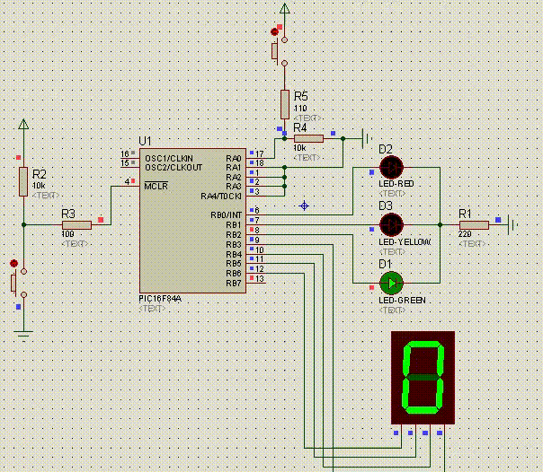

# Semaforo

A Semaphore and counter implemented in assembler for PIC16F84A

Checkout [semaforo.asm](./semaforo.asm) !

Requirements:

- MPLAB X IDE

- GNU/Linux OS

## Demo
Emulation in pro teus 7 4:

